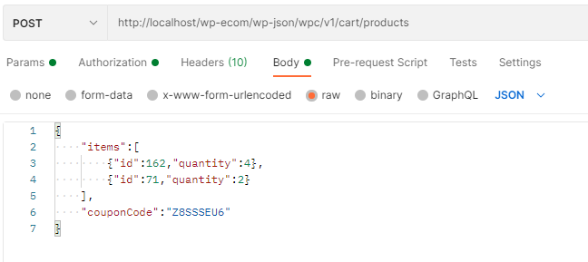
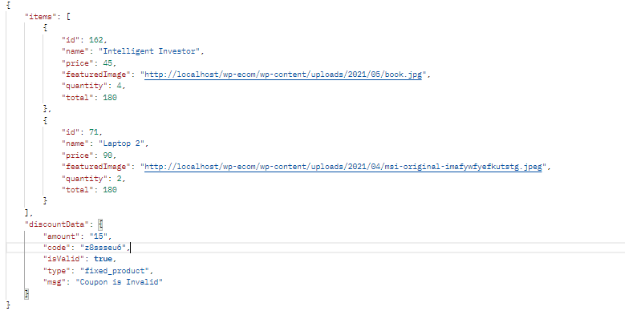

# Wpc Ecom API
This plugin will provide you API routes which will help you to build your own e-commerce platform.

GET ``/wp-json/wpc/v1/products``

Returns all published products with following data.

|   Attribute   |      type      |  example |
|----------|:-------------:|------:|
| id |    number   |   45 |
| name |    string   |   product one|
| slug |    string   |   product-one |
| price |    number   |   45 (without curreny) | 
| sale_price |    number   |   45 |
| featuredImage |    string   |   https://localhost/wordpress/img.png |
| ratings |    number   |   4 (avg) |
| seller|    string   |   john doe |

GET ``/wp-json/wpc/v1/categories``

Returns all Categories  with following data.

|   Attribute   |      type      |  example |
|----------|:-------------:|------:|
| id |    number   |   45 |
| name |    string   |  Laptops|
| slug |    string   |   laptops |
| totalProducts |    number   |   5 | 
| featuredImage |    string   |   https://localhost/wordpress/img.png |

GET ``/wp-json/wpc/v1/categories/<category-slug>``

Returns all products in that category with following data 

|   Attribute   |      type      |  example |
|----------|:-------------:|------:|
| id |    number   |   45 |
| name |    string   |   product one|
| slug |    string   |   product-one |
| price |    number   |   45 (without curreny) | 
| sale_price |    number   |   45 |
| featuredImage |    string   |   https://localhost/wordpress/img.png |
| ratings |    number   |   4 (avg) |
| seller|    string   |   john doe |

GET ``/wp-json/wpc/v1/check-coupon?couponcode=<yourcode>``

Returns `true` or `false` depending upon validity of the coupon

POST ``/wp-json/wpc/v1/cart/products``

 Returns data of the products provided through post request as shown in the example

|   Attribute   |      type      |  example |
|----------|:-------------:|------:|
| items |    array   |   `[{id,name,price,quantity,total}]` |
| discountData |    object   |   `{amount,code,isValid,type,msg}`|

GET ``/wp-json/wpc/v1/cart/available-payment-gateways``

Returns all the available payment gateways with following data

|   Attribute   |      type      |  example |
|----------|:-------------:|------:|
| id |    number   |   4 |
| title |    string   |   Stripe (credit Card)|
| description |    string   |   pay with credit card  |

GET ``/wp-json/wpc/v1/cart/orders-id?cid=<customer id>``

Returns all the order id of customer given the id of customer

|   Attribute   |      type      |  example |
|----------|:-------------:|------:|
| ids |    array   |   `[117,185,114]` |
